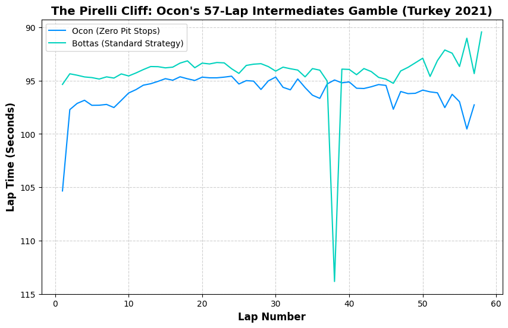
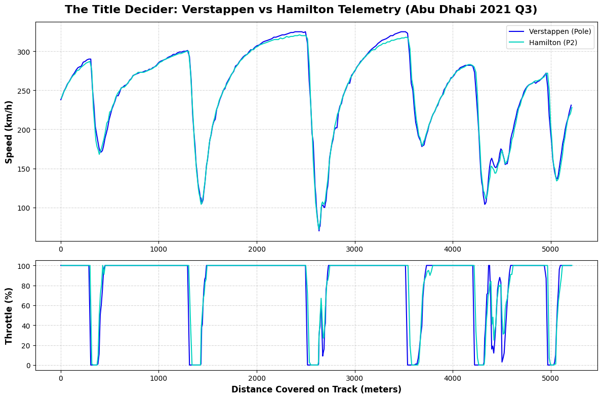

# F1 Strategy & Performance Analytics

This repository contains data-driven insights into Formula 1 race weekends using Python and the FastF1 API.

## 📈 Projects

### 1. The Pirelli "Cliff": Ocon's 57-Lap Gamble (Turkey 2021)
This study visualizes Esteban Ocon's lap times as he completed the entire race on a single set of intermediate tires. 

### 2. The Title Decider: Verstappen vs. Hamilton Telemetry (Abu Dhabi 2021)
A head-to-head comparison of peak speed and throttle application during the final qualifying session of 2021.

