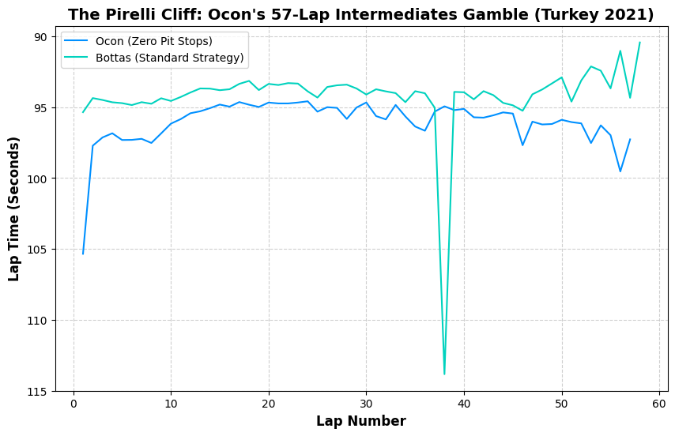
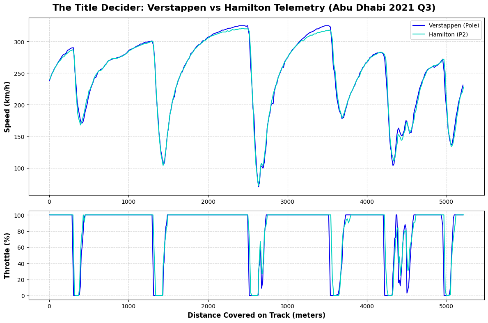
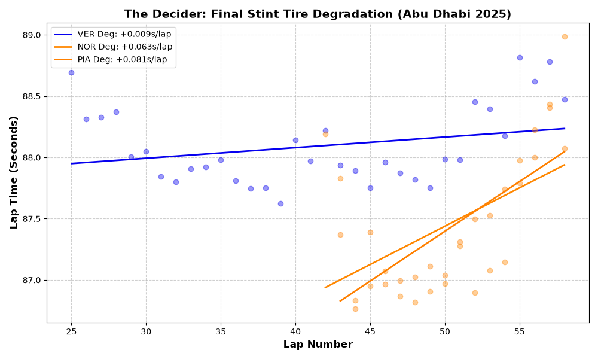

# F1 Strategy & Performance Analytics

This repository contains data-driven insights into Formula 1 race weekends using Python and the FastF1 API.

## 📈 Projects

### 1. The Pirelli "Cliff": Ocon's 57-Lap Gamble (Turkey 2021)
This study visualizes Esteban Ocon's lap times as he completed the entire race on a single set of intermediate tires. 

### 2. The Title Decider: Verstappen vs. Hamilton Telemetry (Abu Dhabi 2021)
A head-to-head comparison of peak speed and throttle application during the final qualifying session of 2021.

### 3. The Decider: Final Stint Tire Degradation (Abu Dhabi 2025)

This script analyzes the final stint of the 2025 Abu Dhabi Grand Prix, modeling the tire degradation of the three podium finishers using linear regression (`numpy.polyfit`). 

**Key Insights:**
* **Max Verstappen:** Maintained a nearly flat degradation slope, losing only **+0.009s per lap**, highlighting exceptional tire management under pressure.
* **Lando Norris:** Experienced standard degradation, dropping **+0.063s per lap**.
* **Oscar Piastri:** Suffered the steepest drop-off at **+0.081s per lap**, visually mapped by the sharpest trendline angle.
