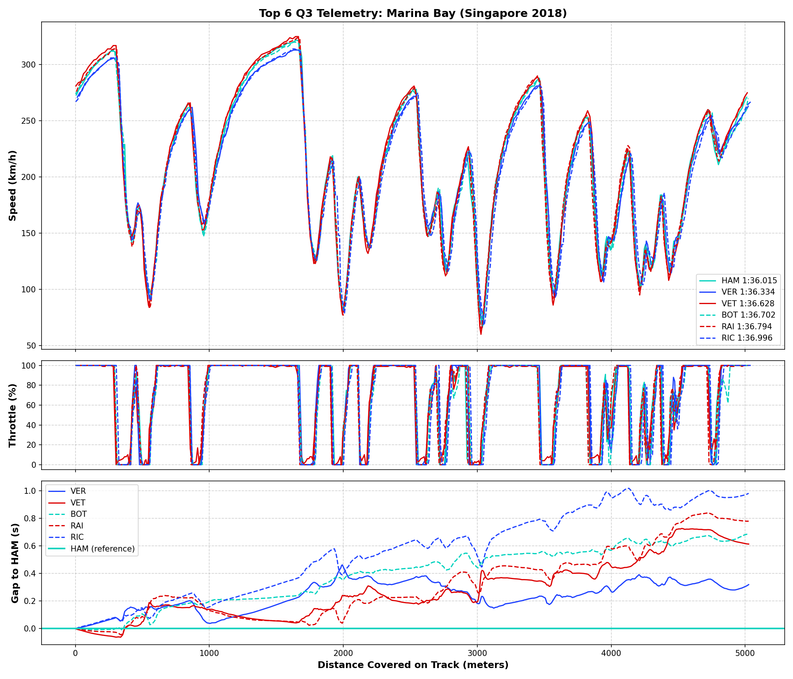

# F1 Strategy & Performance Analytics

This repository contains data-driven insights into Formula 1 race weekends using Python and the FastF1 API.

## 📈 Projects

### 1. The Pirelli "Cliff": Ocon's 57-Lap Gamble (Turkey 2021)
This study visualizes Esteban Ocon's lap times as he completed the entire race on a single set of intermediate tires. 

**Key Insights:**
* **The Pace Cliff:** Ocon's times plummeted drastically in the final 5 laps as the intermediate tread completely wore down to the carcass.
* **Risk vs. Reward:** Skipping the ~20-second pit stop allowed Ocon to narrowly secure a points finish, despite losing several seconds per lap to the leaders at the end of the race.

### 2. The Title Decider: Verstappen vs. Hamilton Telemetry (Abu Dhabi 2021)
A head-to-head comparison of peak speed and throttle application during the final qualifying session of 2021.

**Key Insights:**
* **Setup Differences:** Verstappen's telemetry shows a clear top-speed advantage on the straights, while Hamilton's trace shows higher minimum speeds carried through the medium and high-speed corners.
* **The Slipstream Effect:** The speed trace distinctly visualizes the slipstream boost Verstappen received from teammate Sergio Perez down the long back straight.

### 3. The Decider: Final Stint Tire Degradation (Abu Dhabi 2025)

This script analyzes the final stint of the 2025 Abu Dhabi Grand Prix, modeling the tire degradation of the three podium finishers using linear regression (`numpy.polyfit`). 

**Key Insights:**
* **Max Verstappen:** Maintained a nearly flat degradation slope, losing only **+0.009s per lap**, highlighting exceptional tire management under pressure.
* **Lando Norris:** Experienced standard degradation, dropping **+0.063s per lap**.
* **Oscar Piastri:** Suffered the steepest drop-off at **+0.081s per lap**, visually mapped by the sharpest trendline angle.

### 4. Singapore 2018 Q3: The Ultimate Pole Lap
A telemetry breakdown comparing speed, throttle application, and time delta against Lewis Hamilton's iconic pole lap at Marina Bay. 

**Key Insights:**
* **Perfect Throttle Application:** Hamilton's time delta advantage is largely built out of the low-speed traction zones, getting on the throttle earlier and smoother than the Ferraris and Red Bulls.
* **Engine Drivability:** Telemetry highlights Verstappen's slight throttle hesitations out of key corners, visually mapping the engine mapping issues Red Bull struggled with that weekend.
